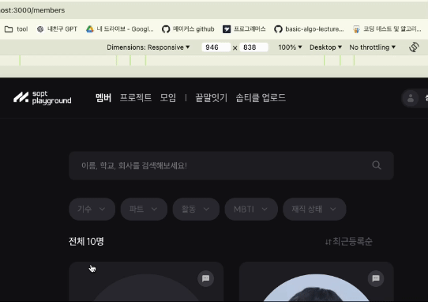

| 작성일     |
| ---------- |
| 2024/05/27 |

# 문제 상황

플레이그라운드의 멤버 탭에서 멤버 목록을 필터링 할 때 발생하는 문제점을 발견했다.



필터링 셀렉트 옵션엔 `전체 기수`라는 디폴트 값과 나머지 선택 가능한 값이 렌더링 되는데,

1. 특정 값을 선택하고(ex. `34기`)
2. `전체 기수`를 선택한 뒤
3. 다시 특정 값(ex. `34기`)을 선택하면 → ⚠️ **아무런 동작도 발생하지 않는다.**


2번 단계에서 `전체 기수`를 선택했고, 따라서 url에 필터링 관련 쿼리 파라미터가 아무것도 적용되지 않은 것을 확인할 수 있다. 그런데, 셀렉트 박스를 눌러봤을 때 옵션 중에 **`34기` 부분이 활성화**되어있는 것을 보면 2번 단계에서 **전체 기수를 선택하는 액션이 어딘가 제대로 작동하지 않았다** 라는 가설을 세워볼 수 있다.

문제를 해결하기에 앞서, 이 컴포넌트는 보기에는 간단해보이지만 매우 많은 코드와 파일들로 이루어져있다. 이 구조를 이해하기 위해 코드를 뜯어보자.

# 셀렉트 박스는 어떻게 구현되어 있나

```tsx
// MemberList/filters/constatns.ts
export const FILTER_DEFAULT_OPTION: Option = {
  value: "",
  label: "전체",
};

export const GENERATION_OPTIONS = (() =>
  GENERATIONS.map((generation) => ({
    value: generation,
    label: `${generation}기`,
  })))();
```

```tsx
// MemberList/index.tsx
const MemberList: FC<MemberListProps> = ({ banner }) => {
	const [generation, setGeneration] = useState<string | undefined>(undefined);
	...

	useEffect(() => {
    if (router.isReady) {
      const { generation, filter, cond, employed, team, mbti, orderBy } = router.query;
      if (typeof generation === 'string' || generation === undefined) {
        setGeneration(generation);
      }
      ...
  }
  ...

  const handleSelectGeneration = (generation: string | undefined) => {
    addQueryParamsToUrl({ generation });
    logClickEvent('filterGeneration', { generation: generation ?? 'all' });
  };
  ...

  return (
  ...

	<MemberListFilter
	  placeholder='기수'
	  defaultOption={GENERATION_DEFAULT_OPTION}
	  options={GENERATION_OPTIONS}
	  value={generation}
	  onChange={handleSelectGeneration}
	/>

	...
	)
```

여기서 useEffect 내부의 코드를 짚고 넘어가자.

모든 라우팅 정보가 준비되면(`router.isReady`), 현재 URL에 포함된 쿼리 파라미터들을 추출하고 해당 값을 state로 설정한다. 즉 라우터가 변경되면 이 컴포넌트에서 사용되는 `generation`이라는 상태 값을 라우터 상의 파라미터 값과 일치시키는 것이다. 이 상태를 `MemberListFilter`의 value값으로 넘기고 있으므로, 즉 이 지역 상태 값은 현재 화면에서 셀렉트 박스의 value값으로 보여지게 하기 위해 존재한다. (→ 따라서 현재 문제와는 무관한 것 같다)

```tsx
// MemberList/filters/MemberListFilter.tsx
import Select from "@/components/members/common/select/Select";

export function MemberListFilter<T extends string>({
  className,
  value,
  defaultOption,
  placeholder,
  options,
  onChange,
  children,
}: PropsWithChildren<MemberListFilterProps<T>>) {
  return (
    <StyledSelect
      className={className}
      placeholder={placeholder}
      value={value}
      onChange={onChange}
      selected={!!value}
    >
      {defaultOption && (
        <StyledSelectItem value={defaultOption?.value}>
          {defaultOption?.label}
        </StyledSelectItem>
      )}
      {options.map((option) => (
        <StyledSelectItem key={option.value} value={option.value}>
          {option.label}
        </StyledSelectItem>
      ))}
      {children}
    </StyledSelect>
  );
}

export default MemberListFilter;

const StyledSelect = styled(Select)<{ selected: boolean }>`
...
`;

const StyledSelectItem = styled(Select.Item)`
...
`;
```

필터링 셀렉트 박스를 보여주는 컴포넌트는 바로 `MemberListFilter`이다. 이 컴포넌트는 `Select`라는 컴포넌트를 가져와 재스타일링 한 컴포넌트이며, 다음과 같은 prop을 사용하고 있다.

- **defaultOption** : 이 prop이 있다면 defaultOption의 value와 label을 사용해 셀렉트 옵션을 만든다. 이 prop으로 `GENERATION_DEFAULT_OPTION`를 넘겨줬으므로 value는 ‘’(빈 문자열), label은 ‘전체 기수’가 되는 것이다.
- **onChange** : `Select` 컴포넌트에서 onChange 이벤트가 발생했을 때 실행하는 함수이다. 이 prop으로 `handleSelectGeneration`을 넘겨주었는데, 해당 함수에서는 `addQueryParamsToUrl({ generation });` 라는 동작을 하고 있다.
  `addQueryParamsToUrl`은 `usePageQueryParams`라는 커스텀 훅의 반환값이다.
  ```tsx
  // MemberList/index.tsx

  const { addQueryParamsToUrl } = usePageQueryParams({
    skipNull: true,
  });
  ```
  ```tsx
  // hooks/usePageQueryParmas.ts

  export function usePageQueryParams(
    options: UsePageQueryParamsOptions = {
      skipNull: false,
    }
  ) {
    const { skipNull } = options;
    const router = useRouter();

    const addQueryParamsToUrl = useCallback(
      (queryParams: NextRouter["query"]) => {
        const mergedParams = { ...router.query, ...queryParams };
        const _queryParams = {
          ...(skipNull ? omitBy(mergedParams, isEmpty) : mergedParams),
        };

        router.push(
          `${router.pathname}${qs.stringify(_queryParams, {
            addQueryPrefix: true,
          })}`,
          undefined,
          {
            scroll: false,
          }
        );
      },
      [router, skipNull]
    );

    return { addQueryParamsToUrl };
  }
  ```
  이 커스텀 훅은 URL에 쿼리 파라미터를 추가하는 기능을 한다. 이 훅에서 반환하는 `addQueryParamsToUrl`을 살펴보자.
  1. 인자로 받은 `queryParams`는 URL에 추가될 새로운 쿼리 파라미터이다.
  2. `queryParams`와 `router.query`(현재 URL에 존재하는 쿼리 파라미터)를 병합한다.
  3. `skipNull` 옵션이 true라면, 병합된 값에서 null이나 undefined를 가진 키를 제거한다. (`MemberList`에서는 이 옵션을 true로 사용하고 있다.)
  4. router.push()로 URL을 업데이트한다.

여기까지 정리하면, 멤버 리스트에서 필터링 셀렉트 박스를 클릭했을 때 다음의 액션이 발생한다.

1. onChange 감지
2. onChange 함수 실행
   1. `addQueryParamsToUrl({generation})` 실행 (`{ generation: generation(선택된 값) }`을 전달)
      1. 전달받은 generation: generation(선택된 값)를 key, value로 URL에 쿼리 파라미터로서 추가한다. `ex. localhost:3000/members?generation=34`
3. URL이 변경되었으므로, URL의 쿼리 파라미터 값으로 `generation` state를 설정한다. `ex. ?generation=34 파라미터가 추가되었으므로 generation state는 '34'가 된다.`

이제 어느정도 컴포넌트에 대해 이해를 했으니, 2탄에서 문제로 돌아가보자!
