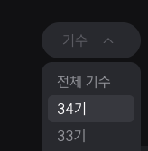
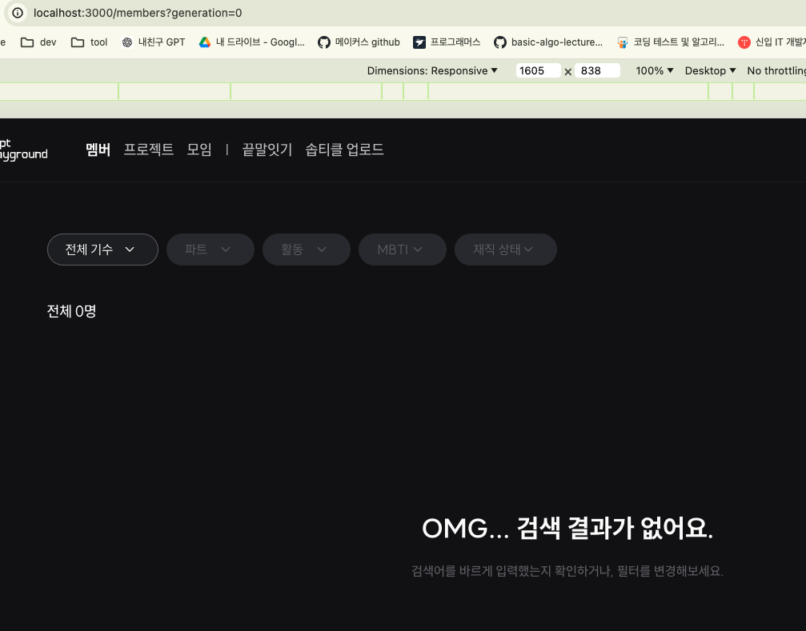
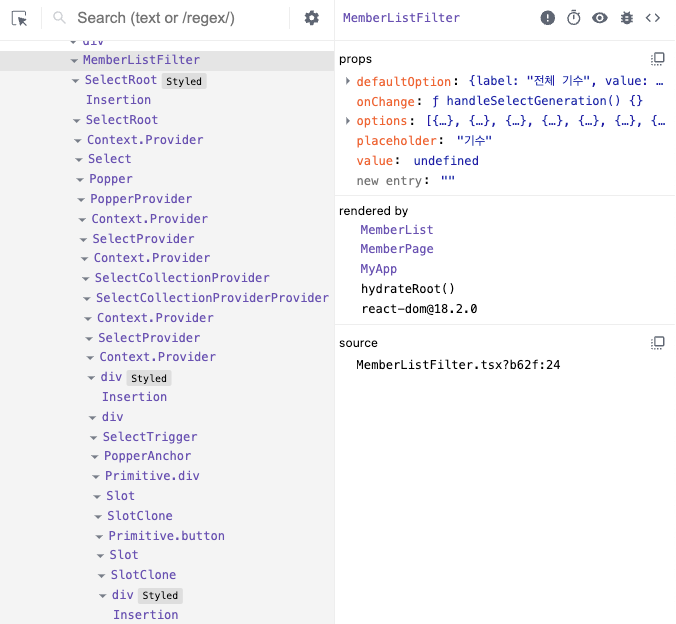
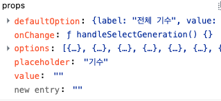
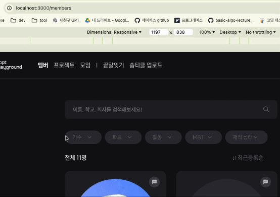

| 작성일     |
| ---------- |
| 2024/05/27 |

1탄에서 코드를 파악했으니, 이제 문제 해결 방법을 찾아보자.

# 문제 파악



다시, 1탄 언급했던 세 단계를 살펴보자.

1. 특정 값을 선택하고(ex. `34기`)
2. `전체 기수`를 선택한 뒤
3. 다시 특정 값(ex. `34기`)을 선택하면 → ⚠️ **아무런 동작도 발생하지 않는다.**

2번 단계에서 `전체 기수`를 선택한 뒤 다시 셀렉트 박스의 토글을 열어보았을 때, 위 사진처럼 방금 선택한 `전체 기수`가 아니라 이전에 선택했던 `34기`가 여전히 활성화되어있는 것을 볼 수 있다. 이 상태에서 다시 `34기`를 선택하면 아무런 동작도 일어나지 않는 것이 문제 상황이었다.

`전체 기수`를 클릭했을 때 URL의 쿼리 파라미터는 정상적으로 변경되었기 때문에 필터링 결과물에는 문제가 없지만, **알 수 없는 이유로 셀렉트 박스 내부에서는 `전체 기수`를 클릭한 상태로 변경되지가 않았고,** 따라서 이 상태에서 `34기`를 선택했을 때 onChange 이벤트가 발생하지 않은 것(이미 `34기`가 선택된 것처럼 작동하기 때문)으로 추측해보았다.

**정리하자면, `전체 기수`를 클릭 했을 때 URL 쿼리 파라미터는 정상적으로 변경되지만, 셀렉트 박스 내에서는 `전체 기수`가 클릭된 것으로 처리가 되지 않은 것이다.**

문제의 원인을 더 명확히 파악하기 위해 다양한 위치에서 콘솔을 찍어보았다.

```jsx
  const handleValueChange = (value) => {
    console.log('Selected value:', value);
    onChange?.(value);
  };
  return (
    ...
      <Select.Root onValueChange={handleValueChange} {...props} open={open} onOpenChange={onOpenChange}>
```

`<Select.Root>` 는 radix-ui에서 제공하는 Select 컴포넌트의 일부이다. 기존에 이 컴포넌트에 onValueChange prop을 넘겨줌으로써 셀렉트 박스의 값이 변경되었을 때 처리할 동작을 전달해주었는데, 그 전에 콘솔을 찍어보았다.

문제 상황에서 onChange 이벤트가 발생하지 않았을 거라고 추측을 했었는데, 예상과 다르게 문제 상황에서도 콘솔이 찍혔다. 다만 value는 빈 문자열(`’’`)이었다.

### 전체 기수에 해당하는 value 값

`전체 기수` 옵션을 선택하면 `전체 기수`라는 라벨에 해당하는 value값을 가져와 사용하는데, 이 value값은 기존에 빈 문자열(`’’`)로 지정되어 있었다.

```tsx
export const GENERATION_DEFAULT_OPTION: Option = {
  value: "",
  label: "전체 기수",
};
```

이 value를 ‘0’으로 바꾸면 아래 사진과 같이 동작한다.



기존에는 전체 기수를 선택하면 URL에서 쿼리 파라미터를 아예 삭제하여 필터링이 디폴트 상태(아무것도 선택되지 않은 상태)가 되게 만들었다. value를 ‘0’으로 지정하면 파라미터 값으로 ‘0’이 들어가므로 이는 필터링한 상태이고, 따라서 셀렉트 박스도 ‘선택된’ 상태로 남아있게 된다. **이렇게 하면 기존의 문제는 해결되지만 원하는 바가 아니다.** 전체 기수를 선택했을 때는 generation 쿼리 파라미터가 존재하지 않으면서, 셀렉트 박스는 디폴트 상태로 돌아가야 한다.

value를 `undefined`로 설정했을땐 빈 문자열일때와 동일한 동작을 보였다.

# React Developer Tools를 이용한 디버깅

예상과는 다르게 흘러가는 데이터가 없는지 확인하기 위해 Reacat Developer Tools를 이용했다.



`전체 기수`를 선택했을 때, `MemberListFilter`에서 value prop으로 `undefined`가 넘겨지고 있었다. 전체 기수에 대한 value 값은 분명 빈 문자열(`’’`)로 설정을 했었는데, 뭔가 생각했던 것과 다르다.

```jsx
<MemberListFilter
  placeholder="기수"
  defaultOption={GENERATION_DEFAULT_OPTION}
  options={GENERATION_OPTIONS}
  value={generation}
  onChange={handleSelectGeneration}
/>
```

왜 이렇게 되었는지 추측해보니, `MemberListFilter`에서 value값으로 넘기는 generation은 지역 상태값이었다. 이 상태 값은 다음과 같이 현재 URL에서 파싱해오는 값이라서, 기수가 선택이 안되어있을 땐 generation 쿼리 파라미터에 대한 값이 아예 존재하지 않기 때문에 undefined로 설정되는 것이었다.

```tsx
const { generation, filter, cond, employed, team, mbti, orderBy } =
  router.query;
if (typeof generation === "string" || generation === undefined) {
  setGeneration(generation);
}
```

그렇다면 이 값이 빈 문자열로 들어간다면 어떨까?



React Developer Tools에서 value값을 임의로 빈 문자열로 바꿔보았더니, 셀렉트 박스에서 이전 값이 홀딩되어있는 기존의 문제가 발생하지 않고, 정상적으로 초기 상태로 돌아가는 것을 확인하였다.

# 문제 해결

위 디버깅에서 발견한 인사이트를 테스트해보기 위해, generation 지역 상태 값이 `undefined`라면 `undefined`로 넘겨주는 것이 아니라 빈 문자열(`’’`)로 넘겨주도록 코드를 수정하였다.

```tsx
<MemberListFilter
	placeholder='기수'
	defaultOption={GENERATION_DEFAULT_OPTION}
	options={GENERATION_OPTIONS}
	value={generation ?? ''} {/*here!*/}
	onChange={handleSelectGeneration}
/>
```


**→ 문제가 해결 되었다!!**

이제 `34기`를 누르고 다시 `전체 기수`를 눌렀을 때, 셀렉트 박스를 열어보면 `전체 기수`를 선택한 상태로 잘 적용되어 있다. 따라서 다시 `34기`를 누르면 정상적으로 작동한다.

그런데 사이드 이펙트가 생겼다. placeholder가 전부 ‘전체’에 해당하는 값으로 변경된 것이다.

원래는 `기수` `파트` `활동` `MBTI` `재직 상태` 여야 하는데, `전체 기수` `전체` `전체` `전체` `전체` 로 바뀌어버렸다.

사실 지금 나타나는 것은 **placeholder가 아니다.** `전체 기수`를 선택한 상태가 **사실은 아무것도 선택되지 않은 상태가 아니기 때문이다.** `전체 기수`에 해당하는 value를 빈 문자열(’’)로 수정했기 때문에, `전체 기수`라는 값을 선택한 상태처럼 보이는 것이다.

이를 해결하기 위해 placeholder가 나타나는 로직을 살펴보았다.

```tsx
// Select.tsx

<Select.Root onValueChange={onChange} {...props} open={open} onOpenChange={onOpenChange}>
        <StyledWrapper allowClear={allowClear && hasValue}>
          <Select.Trigger className={className} asChild>
            <StyledTrigger error={error}>
              {props.value === undefined ? placeholder : label}
              <StyledIconArrow className='icon-arrow'>
                <IconSelectArrow width={18} height={18} alt='select-arrow-icon' />
              </StyledIconArrow>
            </StyledTrigger>
          </Select.Trigger>
          ...
```

이 컴포넌트는 radix-ui/react-select에서 가져온 Select 컴포넌트를 사용하여 커스텀 셀렉트 박스를 구현한 것이다. 여기서 props.value가 undefined이면 placeholder를 보여주고, 아니라면 label을 보여주는 것으로 설계가 되어있는 것을 확인했다.

여기서 props.value가 `undefined`이거나 빈 문자열(`’’`)일 때 placeholder를 보여주도록 수정하면 될 것이다!

```jsx
{
  !props.value ? placeholder : label;
}
```



**→ 모든 문제가 해결되었다!**

결론적으로, 어떠한 value로 설정되어있던 셀렉트 박스의 value를 undefined로 바꿔버리면 예상치못한 버그가 발생할 수 있다는 걸 알게 되었다. 또한 React Developer Tools를 사용한 디버깅이 매우 효과적이라는 걸 깨달았다. 특정 값이 문제를 일으키고있다는 것을 명확히 파악한 뒤에 사용하면 매우 효율적일 것이다.
