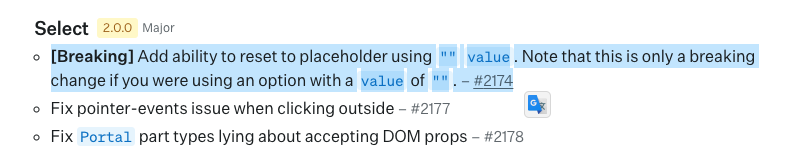

| 작성일     |
| ---------- |
| 2024/05/30 |

이전 글에서는 오류의 해결방안을 찾아냈다. 셀렉트 박스의 value로 빈 문자열(`’’`)을 넘기고, 빈 문자열이 들어올 경우 placeholder를 표시하는 방식으로 해결할 수 있었다.

그러나 여러 시도 끝에 되는 방법을 찾았을 뿐, 기존에 value를 `undefined`로 넘겨주었을 땐 왜 오류가 생겼는지 그 원인은 아직 찾지 못했다

좀 더 명쾌하게 해결해보기 위해, [radix-ui/primitives 깃허브](https://github.com/radix-ui/primitives)를 샅샅히 뒤져보기로 했다.

그리고 Closed된 이슈 중 나처럼 Select의 value를 reset하는 방법에 대해 묻는 이슈를 발견했다!

https://github.com/radix-ui/primitives/issues/1569

토론 내용 중 제시된 한가지 방안으로는, Select 컴포넌트에 key prop을 추가하여 reset을 원할 때 key를 변경해주는 방식이다. 리액트에서 컴포넌트의 key가 변경되면 모든 상태를 리셋(리렌더)하는 특징을 이용한 것이다. 그러나 컴포넌트 전체를 다시 렌더링 하기 위해 key를 변경하는 방식은 리액트에서 일반적인 방식도 아니고, 성능에도 영향을 미친다는 [의견](https://github.com/radix-ui/primitives/issues/1569#issuecomment-1554191237)이 존재했다.

**또한 value에 `undefined`를 넣으면 안되는 이유에 대해 명확한 내용이 있었다.**

[[Select] Unable to clear value and return to `placeholder` · Issue #1569 · radix-ui/primitives](https://github.com/radix-ui/primitives/issues/1569#issuecomment-1420810427)

> radix의 내부 `useControllableState` 훅은 `value === undefined`를 통해 제어 상태와 비제어 상태 간의 전환을 수행합니다.
> **따라서, value에 `undefined`가 아닌 값을 한 번이라도 주게 되면 다시 `undefined`로 되돌릴 수 없습니다. 이는 컴포넌트가 비제어 모드로 전환되며, `undefined` 이전의 마지막 값을 현재 값으로 사용하기 때문입니다.**
> 게다가, `value={null}`을 전달하는 것도 문제가 됩니다. 왜냐면 placeholder 체크도 `value === undefined`를 사용하기 때문입니다.
> 따라서, 컴포넌트와 훅의 생명주기를 완전히 다시 생성하도록 강제하는 키 변경 방법 외에는 해결책이 보이지 않습니다.

아… 이 내용을 읽고나니 모든 것이 명쾌해졌다. 애초에 radix-ui에서, 초기 상태를 제외하고는 Select의 value로 `undefined`를 주는 것이 불가능했다.

**그렇다면 Select를 초기화하고 싶을 땐 어떻게 해야하는걸까?**

나의 이 질문에 대해 이미 많은 논의가 오갔고, radix-ui 개발자는 새로운 PR을 머지했다.

https://github.com/radix-ui/primitives/pull/2174

Select를 초기화하는 방법으로 value에 빈 문자열을 넣도록 한 것이었다.

변경 코드는 다음과 같다.

```tsx
function shouldShowPlaceholder(value?: string) {
  return value === '' || value === undefined;
}

...
data-placeholder={shouldShowPlaceholder(context.value) ? '' : undefined}
```

value가 빈 문자열이거나 undefined라면 placeholder를 노출시킨다.

엇, 그런데 나의 트러블슈팅 과정에서는 value로 빈 문자열을 넘겨도 문제가 해결되지 않았었다.

기존 플레이그라운드 코드 로직이 복잡하게 쌓여있었다보니 중간에 무언가 개입이된건가 싶어서, 아예 radix-ui에서 제공하는 간단한 예제 코드 환경에서 value를 빈 문자열로 넘겨주도록 테스트해보았다. 그런데 여전히 똑같은 문제가 발생하는 것이었다!

이것저것 삽질을 하다가, `아까 그 PR이 머지된게 언제지..?` 라는 생각이 스쳐지나갔다.



그렇다… 이 PR은 최신 버전인 `2.0.0`에서 반영된 사항이었다. 플레이그라운드에서는 radix-ui/react-select 버전이 `^1.2.1`이었다.

테스트해보던 예제 코드 환경에서 버전을 다시 확인하고 재시동을 해보니, PR 내용대로 빈 문자열에 대해 placeholder를 표시하는 동작이 올바르게 작동했다. 아래 링크에서 확인할 수 있다.

[codesandbox.io](https://codesandbox.io/p/devbox/empty-string-to-value-but-not-reset-resolved-3r4rqj?layout=%7B%22sidebarPanel%22%3A%22EXPLORER%22%2C%22rootPanelGroup%22%3A%7B%22direction%22%3A%22horizontal%22%2C%22contentType%22%3A%22UNKNOWN%22%2C%22type%22%3A%22PANEL_GROUP%22%2C%22id%22%3A%22ROOT_LAYOUT%22%2C%22panels%22%3A%5B%7B%22type%22%3A%22PANEL_GROUP%22%2C%22contentType%22%3A%22UNKNOWN%22%2C%22direction%22%3A%22vertical%22%2C%22id%22%3A%22clwt1y4zw00083b6k7wuwdtpo%22%2C%22sizes%22%3A%5B70%2C30%5D%2C%22panels%22%3A%5B%7B%22type%22%3A%22PANEL_GROUP%22%2C%22contentType%22%3A%22EDITOR%22%2C%22direction%22%3A%22horizontal%22%2C%22id%22%3A%22EDITOR%22%2C%22panels%22%3A%5B%7B%22type%22%3A%22PANEL%22%2C%22contentType%22%3A%22EDITOR%22%2C%22id%22%3A%22clwt1y4zw00033b6ko2uz7z75%22%7D%5D%7D%2C%7B%22type%22%3A%22PANEL_GROUP%22%2C%22contentType%22%3A%22SHELLS%22%2C%22direction%22%3A%22horizontal%22%2C%22id%22%3A%22SHELLS%22%2C%22panels%22%3A%5B%7B%22type%22%3A%22PANEL%22%2C%22contentType%22%3A%22SHELLS%22%2C%22id%22%3A%22clwt1y4zw00053b6k9g51ku75%22%7D%5D%2C%22sizes%22%3A%5B100%5D%7D%5D%7D%2C%7B%22type%22%3A%22PANEL_GROUP%22%2C%22contentType%22%3A%22DEVTOOLS%22%2C%22direction%22%3A%22vertical%22%2C%22id%22%3A%22DEVTOOLS%22%2C%22panels%22%3A%5B%7B%22type%22%3A%22PANEL%22%2C%22contentType%22%3A%22DEVTOOLS%22%2C%22id%22%3A%22clwt1y4zw00073b6kuolhglrh%22%7D%5D%2C%22sizes%22%3A%5B100%5D%7D%5D%2C%22sizes%22%3A%5B50%2C50%5D%7D%2C%22tabbedPanels%22%3A%7B%22clwt1y4zw00033b6ko2uz7z75%22%3A%7B%22tabs%22%3A%5B%7B%22id%22%3A%22clwt1y4zw00023b6kp20i9sc6%22%2C%22mode%22%3A%22permanent%22%2C%22type%22%3A%22FILE%22%2C%22filepath%22%3A%22%2FApp.jsx%22%2C%22state%22%3A%22IDLE%22%2C%22initialSelections%22%3A%5B%7B%22startLineNumber%22%3A37%2C%22startColumn%22%3A54%2C%22endLineNumber%22%3A37%2C%22endColumn%22%3A54%7D%5D%7D%5D%2C%22id%22%3A%22clwt1y4zw00033b6ko2uz7z75%22%2C%22activeTabId%22%3A%22clwt1y4zw00023b6kp20i9sc6%22%7D%2C%22clwt1y4zw00073b6kuolhglrh%22%3A%7B%22id%22%3A%22clwt1y4zw00073b6kuolhglrh%22%2C%22activeTabId%22%3A%22clwt1y4zw00063b6kd49ij3bz%22%2C%22tabs%22%3A%5B%7B%22id%22%3A%22clwt1y4zw00063b6kd49ij3bz%22%2C%22mode%22%3A%22permanent%22%2C%22type%22%3A%22TASK_PORT%22%2C%22taskId%22%3A%22start%22%2C%22port%22%3A5173%2C%22path%22%3A%22%2F%22%7D%2C%7B%22type%22%3A%22SANDBOX_INFO%22%2C%22id%22%3A%22clwtb1q66002o3b6icsnuhoyx%22%2C%22mode%22%3A%22permanent%22%7D%5D%7D%2C%22clwt1y4zw00053b6k9g51ku75%22%3A%7B%22id%22%3A%22clwt1y4zw00053b6k9g51ku75%22%2C%22tabs%22%3A%5B%7B%22id%22%3A%22clwt1y4zw00043b6kvxjy8xg1%22%2C%22mode%22%3A%22permanent%22%2C%22type%22%3A%22TASK_LOG%22%2C%22taskId%22%3A%22start%22%7D%5D%2C%22activeTabId%22%3A%22clwt1y4zw00043b6kvxjy8xg1%22%7D%7D%2C%22showDevtools%22%3Atrue%2C%22showShells%22%3Atrue%2C%22showSidebar%22%3Atrue%2C%22sidebarPanelSize%22%3A15%7D)

참고로 `SelectItem`의 value로 바로 빈 문자열을 넣어서는 안되고, 특정 value(예를들면 “reset”)가 들어왔다면 `Select.Root`의 value를 빈 문자열로 넘겨주는 방식으로 작성하였다.

어쩌면 허무하지만, 결론적으로 오류가 났던 것은 최신 버전이 아니었기 때문이라고도 볼 수 있겠다.

# 정리하기

이번 트러블슈팅을 통해 공식 문서와 공식 깃허브를 찾아보는 것의 중요성을 몸소 실감하게 되었다. 깃허브 이슈와 PR에는 매우 생산적인 논의들이 이미 많이 존재하고, 이를 파악하는 것은 시간이 많이 들기는 하지만 무엇보다도 확실한 방법이었다. 또한 패키지를 사용할 때는 버전을 항상 주목할 것. 물론 언제나 바로 마이그레이션 할 수는 없기 때문에 이전 버전에서 오류를 벗어날 다른 방안을 개척하는 것도 중요할 것이다. 그리고 나름대로 그 방법을 찾아냈기 때문에, 성공적인 트러블슈팅이었던 것 같다!
다만 궁금한 점은, 그렇다면 언제쯤 마이그레이션을 진행해야하는 걸까? 프로젝트에서 사용되는 패키지는 매우 많고, 마음대로 버전을 변경했다가는 언제 어디서 오류가 발생할지 모른다. 그래서 여러 기업들에서도 이미 오래된 버전의 패키지를 여전히 사용하는 것을 보기도 했다. 본격적으로 마이그레이션을 하기 전까지는 이렇게 임시 방편을 사용하는 것이 최선일까? 임시 방편을 사용했다면, 마이그레이션 후에는 다른 방법을 사용해야 한다는 사실을 어떻게 효과적으로 아카이빙 할 수 있을까? 나는 우선 PR에 상황을 꼼꼼히 적어놓기로 했다.

- 중간에 내가 radix-ui의 오류를 발견했다고 생각해서 오픈소스 contribute를 할 생각에 두근두근했는데, 이미 해결된 이슈였다니 너무 아쉬웠다! ㅎㅎ

# 관련 링크

https://github.com/radix-ui/primitives/issues/1569

https://github.com/radix-ui/primitives/pull/2167

https://github.com/radix-ui/primitives/pull/2174/files

https://github.com/radix-ui/primitives/issues/2752

### 내 PR

https://github.com/sopt-makers/sopt-playground-frontend/pull/1422
