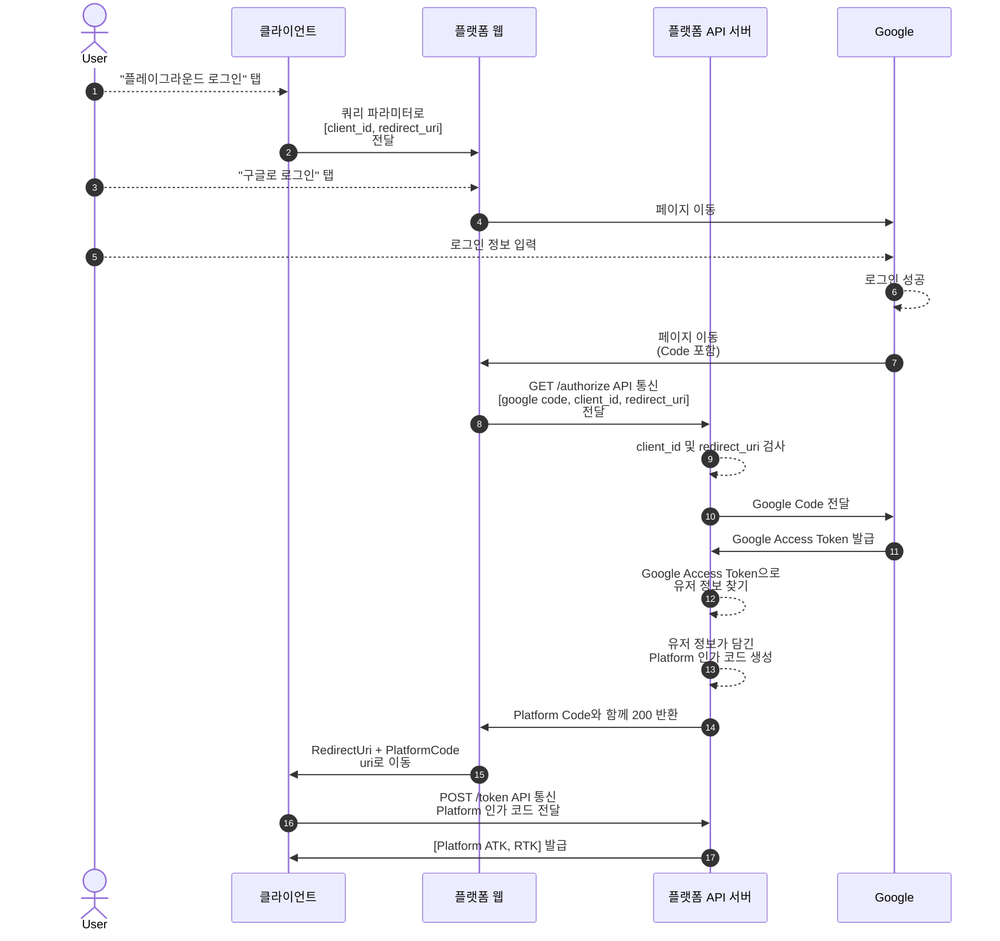

| 작성일     |
| ---------- |
| 2024/05/24 |

SOPT Makers 프로덕트는 동일한 유저 데이터를 기반으로 플레이그라운드, 모임, 앱 등 여러 서비스를 운영하고 있다. 현재 플레이그라운드 내에 인증 로직이 구현되어있다. 회원들은 플레이그라운드에서 SOPT 회원임을 인증한 후 소셜 로그인으로 회원가입을 진행한다. 회원가입 후에는 구글 혹은 페이스북 계정으로 로그인을 하게 된다.

이렇게 인증된 후 발급되는 액세스 토큰을 플레이그라운드 뿐만이 아니라 다른 서비스에서도 사용할 수 있어야 한다. 모임의 경우 playground.sopt.org라는 동일한 origin을 플레이그라운드와 공유하고 있기 때문에 localStorage를 공유할 수 있다는 특징을 이용하여 인증을 진행한다. 앱에서 또한 플레이그라운드의 코드를 앱 서버로 전달하여 액세스 토큰을 발급한다. 즉 모든 서비스가 플레이그라운드의 인증 체계에 의존하고 있다.

이러한 비효율적인 과정을 개선하기 위해, 플레이그라운드에서 인증/인가를 하지 않고 별도의 인증 서버를 구측하여, 서버, 웹 프론트, iOS, AOS에서의 통합 인증을 책임지도록 하게 되었다.

플레이그라운드 웹 프론트에서는 어떤 점을 고려해야하며 어떻게 개발을 해야할까?

# SSO(Single-Sign-On)란?

한 번의 로그인으로 다수의 애플리케이션에 접근할 수 있도록 하는 인증 프로세스이다. 하나의 사용자 정보를 기반으로 여러 시스템에서 하나의 통합 인증을 사용하게 한다.

## SSO의 작동

### SSO의 주요 구성 요소

- Identity Provider (IdP) : 사용자를 인증하고 신원 정보를 제공하는 주체이다. IdP는 사용자의 신원을 증명하는 데 사용할 수 있는 토큰 등을 발급한다.
- Service Provider (SP) : 인증을 위해 IdP에 의존하는 응용 프로그램이나 서비스이다. SP는 IdP가 제공한 신원 정보를 바탕으로 액세스를 부여한다.
- User : 서비스에 액세스하려는 개인이다. IdP와 인증을 수행하고, IdP는 유저의 신원을 SP에 대해 보증한다.

### SSO 서비스

SSO 서비스는 사용자가 로그인할 때 애플리케이션이 사용하는 중앙 서비스이다. 인증되지 않은 사용자가 액세스를 요청한다면 애플리케이션은 해당 사용자를 SSO 서비스로 리디렉션한다. 그런 다음 SSO 서비스가 사용자를 인증하고 원래 애플리케이션으로 리디렉션한다. `→ SSO 서비스를 플랫폼 팀에서 구현`

### SSO 토큰

SSO 토큰은 사용자 식별 정보를 포함하는 디지털 파일이다. 사용자가 애플리케이션에 대한 액세스를 요청하면 애플리케이션은 SSO 토큰을 SSO 서비스와 교환하여 사용자를 인증한다.

### SSO 프로세스

1. 사용자가 애플리케이션에 로그인하면 SSO 토큰을 생성하고 인증 요청을 SSO 서비스로 보낸다.
2. SSO 서비스는 사용자가 이전에 시스템에서 인증되었는지 확인한다. 인증된 경우, 애플리케이션에 인증 확인 응답을 전송하여 사용자에게 액세스 권한을 부여한다.
3. 사용자에게 유효한 보안 인증 정보가 없는 경우 SSO 서비스는 사용자를 로그인 시스템으로 리디렉션한다.
4. 사용자가 로그인 정보를 제출하면 SSO 서비스는 사용자 보안 인증 정보를 확인하고 애플리케이션으로 응답을 보낸다.

> LINE WORKS SSO 참고

# Makers에 적용하는 SSO 설계안

### 1. 클라이언트(로그인 화면) → 플랫폼 웹

`**플레이그라운드 프론트에서 해야 할 일**`

`플레이그라운드 로그인` 버튼을 누르면 .env 파일에 있는 `redirectUri`와 `clientId`를 query parameter로 추가해 **플랫폼 웹으로 이동**한다.

### 2. 플랫폼 웹 -GET /authorize API 요청 → 플랫폼 서버

소셜 로그인에 성공하면 소셜 로그인 이후 받은 `인가 코드`와 함께 query parameter로 넘어온 `redirectUri`, `clientId`를 **플랫폼 서버에 넘겨서** `플랫폼 인가 코드`를 반환 받는다.

### 3. 플랫폼 서버 → 플랫폼 웹 → 클라이언트(리다이렉션 화면)

플랫폼 웹이 플랫폼 인가 코드를 받으면, query parameter로 `플랫폼 인가 코드`를 `redirect uri`에 추가해 해당 url로 리다이렉션 한다.

### 4. 클라이언트(리다이렉션 화면) -POST /token API 요청 → 플랫폼 서버

`**플레이그라운드 프론트에서 해야 할 일**`

플랫폼 인가 코드와 함께 클라이언트로 리다이렉션이 된 후, query parameter에 있는 `플랫폼 인가 코드`를 꺼내서 플랫폼 서버에게 `POST /token 요청`을 하여, `ATK와 RTK`를 반환 받는다.

### 5. 클라이언트(로그인 화면) → 클라이언트(메인 화면)

`**플레이그라운드 프론트에서 해야 할 일**`

ATK, RTK를 성공적으로 받으면, 로컬 스토리지에 저장한 뒤 메인 화면으로 넘어간다.
